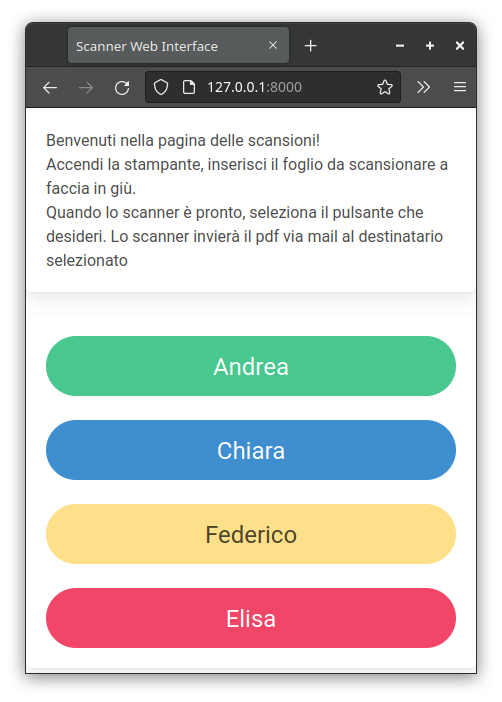

## A simple scanner web interface project

This is a simple program to control our home scanner via a comfortable web interface, that can be opened with a smartphone.

it's also an experiment on how to embed html resources (css, javascript) in a Go binary application

Here how it looks: 
